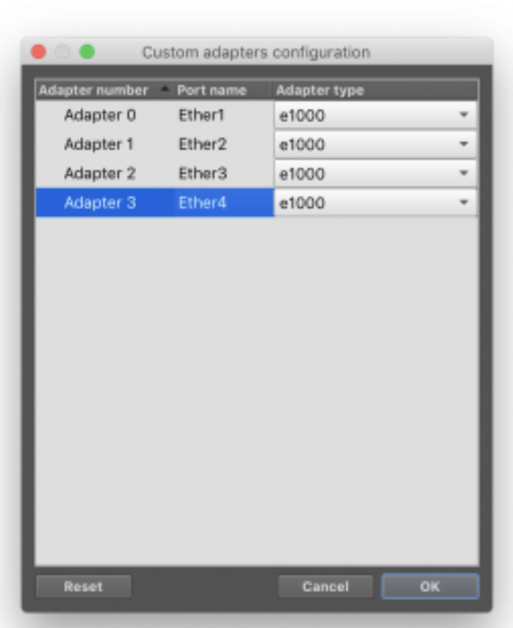
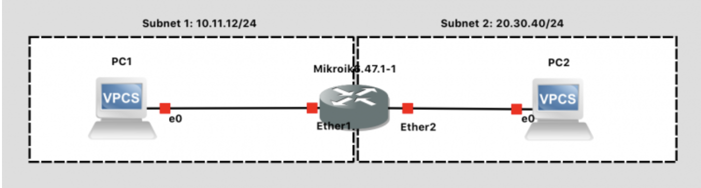

# Установите Mikrotik Router в GNS3
В стандартной комплектации GNS3 не поставляется с маршрутизаторами, только с очень простым коммутатором, концентратором и урезанным «компьютером», подходящим для основных тестов сетевого подключения.  Однако благодаря интеграции с некоторым программным обеспечением эмулятора (QEMU) и виртуальной машиной x86 / x64 (VMware) у него есть возможность запускать реальные операционные системы для маршрутизаторов. Например, вы можете дать GNS3 тот же двоичный образ, который вы загружаете на реальный маршрутизатор, и (при правильной конфигурации ...) он будет «просто работать». Таким образом, вместо того, чтобы работать с факсимильным изображением маршрутизатора, вы можете взаимодействовать с настоящим программным обеспечением маршрутизатора.

Следующим шагом является интеграция в GNS3 образа ОС реального сетевого устройства - маршрутизатора от  Mikrotik . В отличие от некоторых других поставщиков, их образы ОС имеются в свободном доступе и их можно скачать (бесплатная лицензия для указанных образов имеет ограничения на скорость передачи данных 1 Мбит/с, стоит учитывать этот факт при дальнейших проверках).

 Сначала получите образ ОС маршрутизатора:

1.Перейдите на   https://mikrotik.com/
2. Нажмите на «Software» 
3. Прокрутите вниз до раздела «Cloud Hosted Router». 
4. В столбце «Stable» перейдите к строке «Raw disk image». 
5. Нажмите на ссылку для скачивания.
6.Нажмите на ссылку для скачивания.
7. Распакуйте файл

Затем настройте GS3 для распознавания этого образа как действующего маршрутизатора, подходящего для размещения на схеме сети:

1. В GNS3 перейдите в окно настроек
2. Найдите раздел QEMU в окне панели и под ним раздел с надписью «Qemu VMs»
3. Выберите «New», чтобы создать новый шаблон Qemu VM.
4. Выберите «Run this Qemu VM on the GNS3 VM».
5. Введите имя для вашего образа - «Mikrotik 6.47.1» и нажмите «Далее».
6. Выберите объем оперативной памяти для ОС вашего маршрутизатора - 256 МБ 
7. Выберите тип консоли - «Telnet» - и нажмите «Finish».
8. Выберите образ ОС (файл с расширением .img), который вы скачали ранее. Разрешите GNS3 скопировать его в каталог образов по умолчанию и нажмите «Next».
9. Теперь ваш шаблон создан, но нужно изменить несколько  сетевых настроек.

	Найдите панель «Network» для созданного вами образа Mikrotik.  

	1. По умолчанию имеется 1 адаптер Ethernet с типом e1000. Поменяйте его на 4 адаптера. Нажмите «Изменить», выберите вкладку «Сеть» и измените 1 на 4.
	2. Измените формат имени с «Ethernet» на «Ether» в соответствии с синтаксисом интерфейса командной строки маршрутизатора.

	3. В конце исправьте проблему с отображенем.GNS3 нумерует порты начиная с 0, а Mikrotik нумерует их с 1. Если это не исправить, то сетевые данные будут передаваться неправильно. Чтобы исправить это, нажмите кнопку «Настроить пользовательские адаптеры» и переименуйте имена портов с Ethernet0,...,Ethernet3 to Ether1,..,Ether4.. Это будет соответствовать меткам Mikrotik в ОС.

10. На панели «General Settings» измените поле «Category» с «End Devices» на «Routers», чтобы это устройство находилось в категории маршрутизаторов.
11. На панели «General Settings» измените «Symbol», отображаемый на сетевых диаграммах. Нажмите «Browse» и в разделе «Classic» найдите значок «Router».
12. На панели «General Settings» измените параметр «On Close» с «Power Off» на «Send the Shutdown Signal (ACPI)».
13. Нажмите «ОК».

После нажатия «ОК» GNS3 автоматически скопирует образ ОС маршрутизатора Mikrotik в виртуальную машину GNS3 VM, установленную ранее. Эта виртуальная машина содержит необходимое программное обеспечение и настройки для виртуализации сетевых устройств, в данном случае – маршрутизатора Microtik (полный список поддерживаемого оборудования можно найти на официальном сайте GNS3).

**Теперь у вас есть маршрутизатор, который можно добавить в вашу сеть!**

## First Network

1. Create a “New Blank Project” and call it `lab01_your_name_group` (like a `lab01StepanovIKT41`).
2. Drag two “VPCS” (Virtual PCs) onto the blank network diagram from the panel at left (found under the “Browse End Devices” button) .
3. Drag a “Mikrotik” router onto the network diagram from the panel at left (found under the “Browse Routers” button)  
4. Using the “Add a link” button   on the left panel, wire up the network using virtual Ethernet cables! Make your network look like the network below.
	
	* Note: The PCs only have 1 interface, so you can’t connect the wire to the wrong port there
	* Note: The Router has 4 interfaces. The ports you plug your network wires into must be consistent with the way you configure your router in software. For now, just carefully match the diagram. In future labs, when you’re more comfortable, you can make port decisions on your own.
	* Note: Wondering why your diagram doesn’t show port labels? Press the “Show/Hide Interface Labels” button .

5. Press the Start button  to launch your two virtual PCs and router. All the links should turn from RED to GREEN.
6. Press the WebConsole Connect  to pull up a terminal to device. (You could right-click on each and choose Console as well, but we need to configure all three).
7. IMPORTANT: In case of using WEB-mode of GNS3, you will connect to each device manually by click “Web-console” button, or use telnet to connect via remote port mapping, shown on the right side of window, like a 192.168.0.55:5001 (the best practice to use Freeware Putty client)

**At the MikroTIk console:**

1. Note: We are configuring the router first, because we can’t configure the PC network fully until the default gateway (the router) exists.
2. Enter the default Mikrotik login of `admin` with a blank password.
3. Select N when prompted to view the license file.
4. Configure two interfaces (corresponding to the two wires plugged in)
	1. `ip address add address=10.11.12.254/24 interface=ether2`
	2. `ip address add address=20.30.40.254/24 interface=ether3`
5. Print the configuration to confirm: ip address print

**At the PC1 console:**

1. Show the help menu for available command (recall that this is a rudimentary simulated PC): `help`
2. Configure an IP address: `ip 10.11.12.1/24 10.11.12.254`
	1. This sets up a subnet of 10.11.12/24, assigns the PC the IP address 10.11.12.1, with a default gateway of 10.11.12.254 (which is the router)

3. Show the configuration: show ip
4. Save the configuration to persist after power cycling: `save`

**At the PC2 console:**

1. Configure an IP address: `ip 20.30.40.1/24 20.30.40.254`
	1. This sets up a subnet of 20.30.40/24, assigns the PC the IP address 20.30.40.1, with a default gateway of 20.30.40.254 (which is the router)
2. Show the configuration: `show ip`
3. Save the configuration to persist after power cycling: `save`

**Finally, demonstrate the network is functional:**

1. Go to the PC 1 console
2. Ping PC2 through the router: `ping 20.30.40.1` (In case of using Web-console, ping are infinite and Ctrl+C stopping shortcut not working, limit the count of ping packets before command execution!)
3. You should see something to the effect of `84 bytes from 20.30.40.1 icmp_seq=1 ttl=63 time=2.699 ms` indicating that PC2 is responding to PC1.
4. Press CTRL-C to exit

#### ***Lab Submission Instructions:***
* Take a screenshot showing:
	1. Your GNS3 topology
	2. Your PC1 terminal with BOTH its IP address information AND the successful ping(s) to PC2 clearly visible.

**Upload your screenshot to the Lab 1 \*doc file & put it to ORIOKS homework subsystem.**

When finished, press the Stop button   and exit GNS3. The GNS3 VM (in VMware) should halt and exit automatically.

